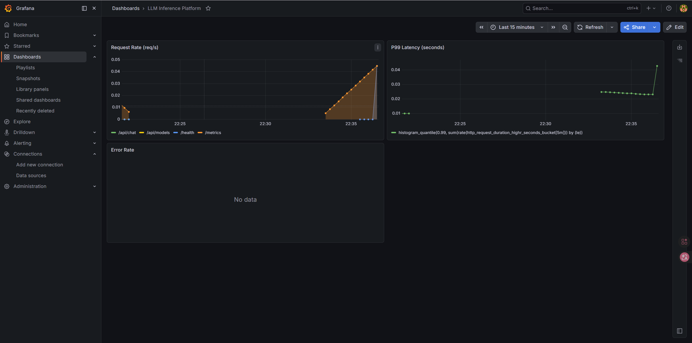
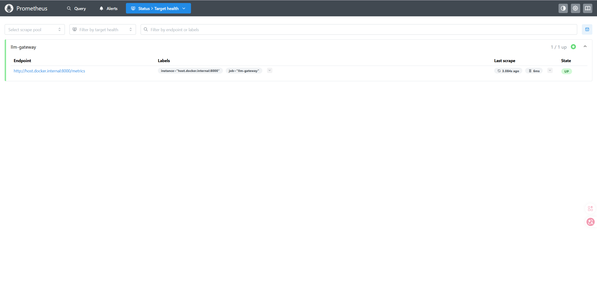

# LLM Inference Platform

A production-oriented multi-model LLM inference platform built with Ollama, Docker, and Kubernetes. Designed for self-hosted deployment with unified API access, monitoring, and auto-scaling.

> 🚧 **Status: Active Development** — Building in public. Follow along with the progress.

---

## Architecture

```
┌─────────────────────────────────────────────┐
│              Client Applications             │
└─────────────────┬───────────────────────────┘
                  │ HTTP REST API
┌─────────────────▼───────────────────────────┐
│              API Gateway (FastAPI)           │
│         Unified endpoint for all models      │
└──────┬──────────────────────┬───────────────┘
       │                      │
┌──────▼──────┐        ┌──────▼──────┐
│  Llama 3.2  │        │   Mistral   │
│  (Ollama)   │        │  (Ollama)   │
└─────────────┘        └─────────────┘
       │                      │
┌──────▼──────────────────────▼───────────────┐
│         Prometheus + Grafana                 │
│    Metrics: QPS / Latency / Memory Usage     │
└─────────────────────────────────────────────┘
```

---

## Features

- **Multi-model support** — Run and switch between multiple open-source LLMs (Llama 3.2, Mistral, and more)
- **Unified REST API** — Single endpoint regardless of which model is serving
- **Containerized** — Full Docker Compose setup for local development
- **Kubernetes-ready** — K8s manifests with HPA (Horizontal Pod Autoscaler)
- **Observability** — Prometheus metrics + Grafana dashboards out of the box
- **Self-hosted** — No API keys, no cloud costs, runs on your own hardware

---

## Tech Stack

| Component | Technology |
|---|---|
| LLM Runtime | [Ollama](https://ollama.ai) |
| API Gateway | FastAPI (Python) |
| Containerization | Docker + Docker Compose |
| Orchestration | Kubernetes (K8s) |
| Monitoring | Prometheus + Grafana |
| IaC | Terraform (AWS deployment) |

---

## Getting Started

### Prerequisites

- Docker & Docker Compose
- 8GB+ RAM (16GB recommended for multiple models)
- [Ollama](https://ollama.ai/download) installed

### Quick Start

```bash
# Clone the repository
git clone https://github.com/instarwxp/llm-inference-platform.git
cd llm-inference-platform

# Pull required models
ollama pull llama3.2
ollama pull mistral

# Start the platform
docker compose up -d

# Test the API
curl http://localhost:8000/health
```

### API Usage

```bash
# Send a prompt to the default model
curl -X POST http://localhost:8000/api/chat \
  -H "Content-Type: application/json" \
  -d '{"model": "llama3.2", "message": "Hello, how are you?"}'

# List available models
curl http://localhost:8000/api/models
```

---

## Project Roadmap

- [x] Local Ollama setup with llama3.2
- [x] WSL2 + Docker environment
- [x] FastAPI gateway with model routing
- [x] Docker Compose multi-service setup
- [x] Prometheus metrics integration
- [x] Grafana dashboard
- [x] Kubernetes manifests + HPA
- [x] Load testing & performance benchmarks
- [ ] Terraform AWS deployment

---

## Monitoring

Once running, access the dashboards at:

| Service | URL |
|---|---|
| API Gateway | http://localhost:8000 |
| Grafana | http://localhost:3000 |
| Prometheus | http://localhost:9090 |
| Ollama API | http://localhost:11434 |

---

## Performance Targets

| Metric | Target |
|---|---|
| P99 Latency | < 2000ms |
| Concurrent Requests | 20+ |
| Model Switch Time | < 5s |
| Uptime | 99.9% |

---

## Development Log

| Date | Milestone |
|---|---|
| 2026-05-12 | Project initialized, Ollama + Docker environment ready |
| 2026-05-13 | Added full observability stack — Prometheus + Grafana dashboards |
| 2026-05-13 | Kubernetes deployment with k3d, HPA auto-scaling, Locust load testing |

---

## About

Built by a DevOps/Infrastructure engineer transitioning into AI Infrastructure engineering. This project documents the journey of building production-grade LLM serving infrastructure from scratch.

**Skills demonstrated:** Linux · Docker · Kubernetes · CI/CD · Monitoring · Python · LLM Deployment

---

## License

MIT License — feel free to use this as a reference for your own LLM infrastructure projects.

## Screenshots

### Grafana Monitoring Dashboard


*Real-time monitoring: Request Rate by endpoint, P99 Latency, Error Rate*

### Prometheus Targets


*LLM Gateway target — State: UP, scraped every 15s*

## Performance Benchmarks

Load test results (10 concurrent users, 60 seconds, using Locust):

| Endpoint | RPS | Median Latency | P99 Latency | Error Rate |
|---|---|---|---|---|
| GET /health | 3.3 | 3ms | 16ms | 0% |
| GET /api/models | 2.0 | 21ms | 37ms | 0% |
| POST /api/chat | 0.97 | 250ms | 3400ms | 0% |
| **Total** | **6.3** | **6ms** | **540ms** | **0%** |

> Tested on: Windows 11, WSL2, NVIDIA RTX 3060 Ti 8GB, 32GB RAM
> LLM: Llama 3.2 (3.2B parameters, Q4_K_M quantization)
